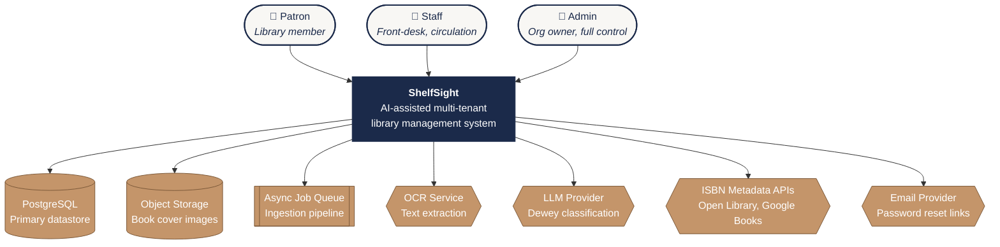

# 01 · System Context

The highest-level view of ShelfSight: who uses it, and which external systems
it depends on. Equivalent to a **C4 Level 1 (System Context)** diagram.

## Actors

| Actor      | Role     | Primary use cases                                                                                       |
|------------|----------|---------------------------------------------------------------------------------------------------------|
| **Patron** | `PATRON` | Browse the catalog, view their own loans and fines, pay fines.                                          |
| **Staff**  | `STAFF`  | Check books in/out, manage shelves, run AI ingestion, view transaction history, waive fines.            |
| **Admin**  | `ADMIN`  | Everything Staff can do, plus user management, invites, org settings, and full delete operations.       |

## External systems

| System                   | Purpose                                                                                | Required?                    |
|--------------------------|----------------------------------------------------------------------------------------|------------------------------|
| **PostgreSQL**           | Primary datastore for all business data. Accessed via Prisma ORM.                      | **Yes**                      |
| **Object Storage**       | Holds uploaded book cover/spine images.                                                | Optional (stub URL fallback) |
| **Async Job Queue**      | Decouples the AI ingestion pipeline from the synchronous request/response cycle.       | Optional (sync path works)   |
| **OCR Service**          | Extracts text from book cover/spine images for ISBN detection and Dewey classification. | Optional (graceful skip)     |
| **LLM Provider**         | Classifies books into Dewey Decimal categories from OCR'd text.                        | Optional (graceful skip)     |
| **ISBN Metadata APIs**   | Look up bibliographic data by ISBN. Open Library is the primary source; Google Books is the fallback. | No — public APIs |
| **Email Provider**       | Sends one-time password-reset links.                                                   | Optional (link logged if absent) |

## Notes

- ShelfSight is **infrastructure-agnostic by design**. Each external dependency
  is referred to by role, not vendor. The current implementation uses AWS S3,
  AWS SQS, AWS Textract, OpenAI, and Resend — but each can be swapped without
  changing the architecture.
- All AI/cloud integrations are **optional**. The app boots and works without
  any AWS or OpenAI credentials; the ingestion pipeline simply skips the
  steps it can't perform and the rest of the system runs unaffected.
