# 02 · System Architecture

The container view of ShelfSight: every major component, the protocol it
speaks, and which other components it talks to. Equivalent to a **C4 Level 2
(Container)** diagram.

```mermaid
flowchart LR
    Browser["🌐 Browser<br/>(Patron / Staff / Admin)"]

    subgraph Frontend["Frontend · Next.js 16 App Router"]
        direction TB
        FENext["<b>Next.js Server</b><br/>App Router · React 19<br/>TypeScript · Turbopack"]
        FEProxy["<b>Reverse proxy</b><br/>rewrites: /api/* → BACKEND_URL<br/>(next.config.ts)"]
        FEAuth["<b>AuthProvider</b><br/>React Context<br/>useAuth() hook"]
        FEAPI["<b>apiFetch / apiUpload</b><br/>credentials: 'include'<br/>envelope normalisation"]
        FEUI["<b>UI</b><br/>Tailwind v4 · shadcn/ui (46)<br/>React Flow · dnd-kit · recharts"]
    end

    subgraph Backend["Backend · Express 4 REST API"]
        direction TB
        BEMid["<b>Middleware stack</b><br/>helmet · cors · cookie-parser<br/>express.json · rate-limit (prod)<br/>morgan / httpAccessLog"]
        BEAuth["<b>Auth middleware</b><br/>requireAuth (JWT cookie)<br/>requireRole (RBAC)"]
        BERoutes["<b>Routes</b><br/>/auth · /books · /loans · /fines<br/>/map · /ingest · /users · /orgs<br/>/transactions · /health"]
        BECtrl["<b>Controllers</b>"]
        BESvc["<b>Services</b><br/>(business logic)"]
        BEPrisma["<b>Prisma client</b><br/>lib/prisma.ts<br/>forOrg(orgId) row scoping"]
        BELambda["<b>Lambda handler</b><br/>lambdas/ingest.handler.ts<br/>(async pipeline)"]
    end

    subgraph Data["Data & Integrations"]
        direction TB
        DB[("<b>PostgreSQL 16</b><br/>15 migrations · GIN indexes")]
        OS[("<b>Object Storage</b><br/>Cover images")]
        Q[["<b>Job Queue</b><br/>INGEST_ANALYZE messages"]]
        OCR{{"<b>OCR Service</b><br/>DetectDocumentText"}}
        LLM{{"<b>LLM Provider</b><br/>Dewey + metadata extraction"}}
        ISBN{{"<b>ISBN APIs</b><br/>Open Library → Google Books"}}
        Mail{{"<b>Email Provider</b><br/>Password reset"}}
    end

    Browser -- "HTTPS · HttpOnly cookie<br/>SameSite=Lax/None" --> FENext
    FENext --- FEUI
    FENext --- FEAuth
    FEAuth --- FEAPI
    FEAPI -- "fetch /api/*<br/>credentials: include" --> FEProxy
    FEProxy -- "HTTP · forwards cookie<br/>(server-side, same-origin)" --> BEMid

    BEMid --> BEAuth
    BEAuth --> BERoutes
    BERoutes --> BECtrl
    BECtrl --> BESvc
    BESvc --> BEPrisma
    BEPrisma -- "SQL" --> DB

    BESvc -- "PutObject" --> OS
    BESvc -- "SendMessage" --> Q
    BESvc -- "DetectText" --> OCR
    BESvc -- "Chat completion" --> LLM
    BESvc -- "GET ISBN lookup" --> ISBN
    BESvc -- "Send reset link" --> Mail

    Q -. "triggers" .-> BELambda
    BELambda --> OCR
    BELambda --> LLM
    BELambda --> BEPrisma

    classDef fe fill:#F8F7F4,stroke:#1B2A4A,color:#1B2A4A
    classDef be fill:#1B2A4A,stroke:#1B2A4A,color:#fff
    classDef ext fill:#C4956A,stroke:#7d5a3a,color:#fff
    classDef store fill:#fff,stroke:#1B2A4A,stroke-dasharray: 4 2
    class FENext,FEProxy,FEAuth,FEAPI,FEUI fe
    class BEMid,BEAuth,BERoutes,BECtrl,BESvc,BEPrisma,BELambda be
    class OS,Q,OCR,LLM,ISBN,Mail ext
    class DB store
```

## Wire-level details

### Browser ↔ Frontend
- HTTPS in production (HTTP in dev).
- Authentication is carried by an **HttpOnly cookie** named `token`
  (`auth.controller.ts` — `COOKIE_OPTIONS`). The cookie is `SameSite=Lax` in
  development and `SameSite=None; Secure` in production, with a 7-day max-age
  (`auth.service.ts` — `JWT_EXPIRES_IN = '7d'`).
- All `fetch` calls from `src/lib/api.ts` use `credentials: 'include'` so the
  cookie travels with every request.

### Frontend ↔ Backend
- Default API base is `/api` — Next.js rewrites `/api/:path*` to
  `${BACKEND_URL}/:path*` (`next.config.ts`). This keeps requests
  same-origin from the browser's perspective, so cookies "just work" without
  CORS or `SameSite=None`.
- `NEXT_PUBLIC_API_URL` can be set to bypass the proxy and call the backend
  directly during local development.

### Backend middleware stack (in order)
1. `helmet()` — security headers.
2. `cors({ origin: CORS_ORIGIN, credentials: true })`.
3. `express.json({ limit: '10mb' })` — body limit configurable via
   `JSON_BODY_LIMIT`.
4. `cookie-parser` — parses the `token` cookie into `req.cookies`.
5. **Production-only** rate limiters:
   - Global: 300 requests / 15 min / IP.
   - `/auth/login`: 15 requests / 15 min / IP.
6. Logging — `morgan('dev')` in development, structured `httpAccessLog` in
   production.
7. Routes (mounted at `/`).
8. `errorHandler` — uniform JSON error responses.

(Source: `shelfsight-backend/src/app.ts`.)

### Backend ↔ Data
- **PostgreSQL** via Prisma. Every request that operates on tenant data goes
  through `forOrg(organizationId)` (see [10 · Multi-Tenancy](./10-multi-tenancy.md))
  which auto-injects `organizationId` into every query.
- **Object Storage** for book cover images (10 MB multer memory upload →
  `PutObjectCommand`).
- **Job Queue** is fire-and-forget; the synchronous handler still returns
  results even if the queue publish fails.
- The **Lambda handler** (`src/lambdas/ingest.handler.ts`) is the
  asynchronous consumer of the queue and runs the same pipeline that the
  synchronous controller does.

## Tech stack reference

| Layer    | Technology                                                                                        |
|----------|---------------------------------------------------------------------------------------------------|
| Frontend | Next.js 16 · React 19 · TypeScript · Tailwind CSS v4 · shadcn/ui · React Flow · @dnd-kit · recharts · sonner · vitest · Playwright |
| Backend  | Node 20 · Express 4 · TypeScript · Prisma 5 · helmet · cors · multer · express-rate-limit · bcryptjs · jsonwebtoken |
| Data     | PostgreSQL 16 · trigram (GIN) full-text indexes                                                   |
| AI       | LLM provider (chat completions, configurable via `OPENAI_MODEL`)                                  |
| OCR      | Cloud OCR via `DetectDocumentText`                                                                |
