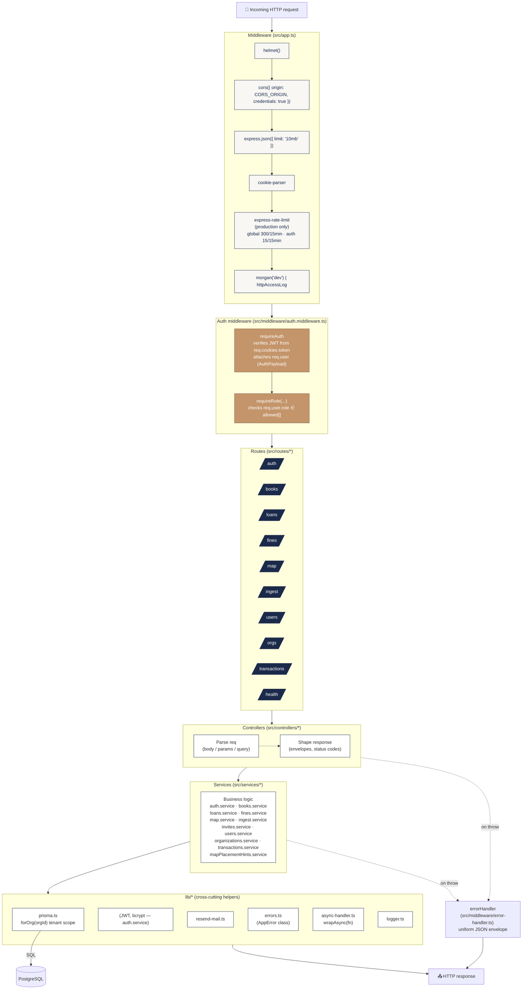

# 03 · Backend Layers

The Express backend follows a strict layered architecture. Each request flows
top-to-bottom through middleware, route, controller, service, and finally
Prisma — never skipping layers.



## Layer responsibilities

| Layer           | Folder                       | Responsibility                                                                          | Forbidden from                                |
|-----------------|------------------------------|-----------------------------------------------------------------------------------------|-----------------------------------------------|
| **Middleware**  | `src/middleware/` & `src/app.ts` | Cross-cutting concerns: security headers, CORS, body parsing, rate limiting, auth, errors. | Containing business logic.                    |
| **Routes**      | `src/routes/`                | HTTP method + path → controller binding. Apply `requireAuth` / `requireRole`.            | Containing logic. Routes should be one-liners. |
| **Controllers** | `src/controllers/`           | Translate `Request` → service input, then service output → `Response`.                   | Calling Prisma directly.                       |
| **Services**    | `src/services/`              | All business logic. Orchestrate Prisma + external APIs. Throw `AppError` for known failures. | Touching `req` / `res`.                     |
| **Lib**         | `src/lib/`                   | Stateless helpers used by every layer (Prisma client, error class, JWT, email).         | Holding mutable state.                         |

## Key patterns

### `wrapAsync`
Every async controller is wrapped with `wrapAsync(handler)` from
`src/lib/async-handler.ts`. This bridges promise rejections into Express's
`next(err)` so the global `errorHandler` can format them.

```ts
router.post('/checkout', requireAuth, requireRole('ADMIN', 'STAFF'), wrapAsync(checkout));
```

### `AppError`
A custom error class (`src/lib/errors.ts`) carrying `statusCode`, `code`
(machine-readable string like `RESOURCE_UNAVAILABLE`), `message`, and an
optional `details` payload (used for `fieldErrors`). The error handler turns
this into a uniform JSON envelope.

### `forOrg(organizationId)`
A tenant-scoped extension of the Prisma client that injects
`organizationId` into every query. Used by every service that runs on behalf
of an authenticated user. See [10 · Multi-Tenancy](./10-multi-tenancy.md).

```ts
const db = forOrg(organizationId);
const books = await db.book.findMany({ where: { genre: 'fiction' } });
//                                          ↑ organizationId auto-added
```

### Health probes
- `GET /health` — liveness (always 200 if the process is up).
- `GET /health/ready` — readiness (runs `SELECT 1` against PostgreSQL,
  returns 503 if the DB is unreachable).

## Folder layout

```
shelfsight-backend/src/
├── index.ts                    # process entry — env validation, listen
├── app.ts                      # Express app + middleware stack
│
├── routes/
│   ├── index.ts                # mounts all sub-routers
│   ├── auth.ts        books.ts
│   ├── loans.ts       fines.ts
│   ├── map.ts         ingest.ts
│   ├── users.ts       organizations.ts
│   ├── invites.ts     transactions.ts
│   └── test.routes.ts          # dev/test only
│
├── controllers/                # one per resource
├── services/                   # one per resource (+ mapPlacementHints)
├── middleware/
│   ├── auth.middleware.ts      # requireAuth, requireRole
│   └── error-handler.ts
├── lib/
│   ├── prisma.ts               # singleton + forOrg() extension
│   ├── async-handler.ts        # wrapAsync
│   ├── errors.ts               # AppError
│   ├── email.ts                # normaliseEmail
│   ├── resend-mail.ts          # password reset email
│   ├── http-access-log.ts      # production access log
│   └── logger.ts
├── lambdas/
│   └── ingest.handler.ts       # async pipeline consumer
└── types/
    └── express.d.ts            # req.user augmentation
```
