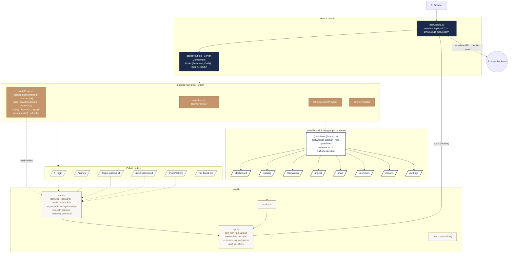
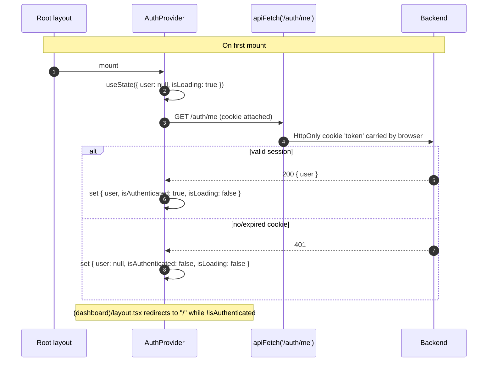

# 04 · Frontend Architecture

The frontend is a **Next.js 16 App Router** application running on React 19.
Almost every page is a client component (`"use client"`) — the server is
mainly there to host the proxy, fonts, and the root layout.

## Application tree

## Routing

| Group         | Path                          | Description                                                                |
|---------------|-------------------------------|----------------------------------------------------------------------------|
| Root          | `/`                           | Login form. Redirects to `/dashboard` if already authenticated.            |
| Public        | `/signup`                     | Create a new organization + first ADMIN user.                              |
| Public        | `/forgot-password`            | Request a password reset email.                                            |
| Public        | `/reset-password`             | Set a new password from a reset token (`?token=…`).                        |
| Public        | `/invite/[token]`             | Accept an invite. Renders org name + role from the token preview.          |
| `(dashboard)` | `/dashboard`                  | Role-aware landing page. Different KPIs for admin / staff / patron.        |
| `(dashboard)` | `/catalog`                    | Book CRUD, search, bulk upload (XLSX / ISBN list / file).                  |
| `(dashboard)` | `/circulation`                | Checkout, check-in, active loans, fines, transaction history.              |
| `(dashboard)` | `/ingest`                     | AI book-ingestion image upload + job-review dialog.                        |
| `(dashboard)` | `/map`                        | 2-D library floor map (React Flow + dnd-kit) and first-person shelf view.  |
| `(dashboard)` | `/members`                    | User management (Admin only).                                              |
| `(dashboard)` | `/reports`                    | Analytics dashboards (recharts) — circulation, collection, financial.      |
| `(dashboard)` | `/settings`                   | Organization rename, profile, invite management.                           |

## Authentication on the client

- `apiFetch` (in `src/lib/api.ts`) always sets `credentials: 'include'`, so
  the browser ships the `token` cookie with every request.
- The dashboard layout watches `useAuth()`; when `isLoading === false &&
  !isAuthenticated`, it redirects to `/`.
- The sidebar nav is **role-gated client-side**: `Members`, `Reports`,
  `Ingest`, etc. are filtered out for `PATRON` users. Server-side enforcement
  is the source of truth (see [11 · RBAC Matrix](./11-rbac-matrix.md)) — the
  client filter is purely cosmetic.

## Same-origin proxy

The frontend never points the browser directly at the backend in production.
Instead, `next.config.ts` rewrites every `/api/*` URL on the server side to
`BACKEND_URL/*`. This means:

| Concern                           | Outcome                                                   |
|-----------------------------------|-----------------------------------------------------------|
| Browser sees cookie as same-origin| `SameSite=Lax` works in dev, no CORS preflight in prod    |
| `BACKEND_URL` not exposed         | It has no `NEXT_PUBLIC_` prefix → server-only             |
| Local-only direct calls           | Override with `NEXT_PUBLIC_API_URL=http://localhost:3001` |

## Build, lint, test

| Command              | Purpose                                                |
|----------------------|--------------------------------------------------------|
| `npm run dev`        | Next.js dev server with Turbopack.                     |
| `npm run build`      | Production build.                                      |
| `npm run start`      | Production server.                                     |
| `npm run lint`       | ESLint 9 with `eslint-config-next`.                    |
| `npm run typecheck`  | `tsc --noEmit`.                                        |
| `npm run test`       | Vitest unit tests.                                     |
| `npm run test:e2e`   | Playwright end-to-end tests.                           |

## Component library

- `src/components/ui/` — 46 shadcn/ui primitives (button, card, dialog,
  table, tabs, sheet, drawer, command, popover, calendar, …).
- `src/components/map/` — feature-specific React Flow + dnd-kit components:
  `MapCanvas`, `ShelfNode`, `ShelfPalette`, `ShelfSettingsPanel`,
  `ShelfFirstPersonView`, `MapCallbacksContext`, `mapLayoutSignature`.
- `src/components/ingest/` — `JobReviewDialog`.
- `src/components/auth-provider.tsx`, `providers.tsx`, `checkout-cart-provider.tsx`
  — top-level Context providers.
