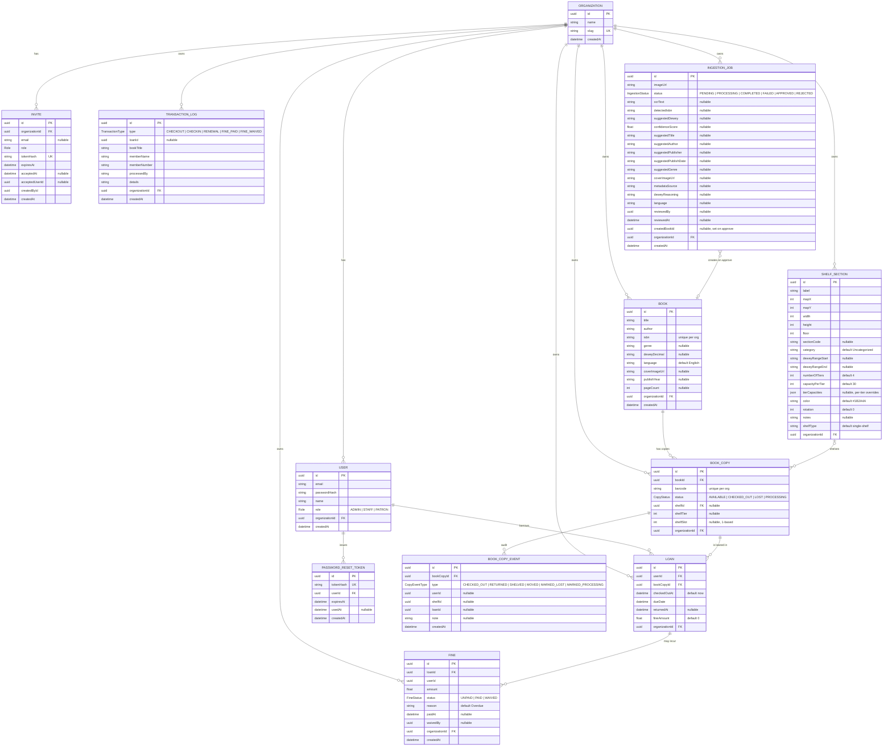

# 05 · Database — Entity Relationship Diagram

The data model. All 12 Prisma models and their relationships, from
`shelfsight-backend/prisma/schema.prisma` (296 lines, 15 migrations as of
this writing).

> For full field types, indexes, and enum members see
> [06 · Schema Detail](./06-database-schema-detail.md).

## Relationship summary

| From → To                              | Cardinality | Notes                                                     |
|----------------------------------------|-------------|-----------------------------------------------------------|
| `Organization` → most tables           | 1 : N       | Multi-tenant root. Cascade delete via Invite, manual otherwise. |
| `User` → `Loan`                        | 1 : N       | All borrows, historical and active.                       |
| `User` → `PasswordResetToken`          | 1 : N       | `onDelete: Cascade`.                                      |
| `Book` → `BookCopy`                    | 1 : N       | A book may have many physical copies.                     |
| `BookCopy` → `Loan`                    | 1 : N       | A copy can be loaned many times over its life.            |
| `BookCopy` → `BookCopyEvent`           | 1 : N       | Append-only audit trail.                                  |
| `ShelfSection` → `BookCopy`            | 0..1 : N    | A copy may not be shelved (`shelfId` is nullable).        |
| `Loan` → `Fine`                        | 1 : N       | A loan may incur multiple fines (currently one).          |
| `IngestionJob` → `Book`                | 0..1 : 1    | After approval, `createdBookId` points at the new book.   |
| `Invite` → `Organization`              | N : 1       | `onDelete: Cascade` — invites die with their org.         |

## Multi-tenancy via `organizationId`

Every business table carries an `organizationId` column and **most uniques
are composite with `organizationId`**:

| Table         | Composite unique             |
|---------------|------------------------------|
| `User`        | `(organizationId, email)`    |
| `Book`        | `(organizationId, isbn)`     |
| `BookCopy`    | `(organizationId, barcode)`  |

This means an ISBN, email, or barcode that's taken in one org can be reused
in another. See [10 · Multi-Tenancy](./10-multi-tenancy.md) for how the
backend enforces this at runtime via the `forOrg(orgId)` Prisma extension.
