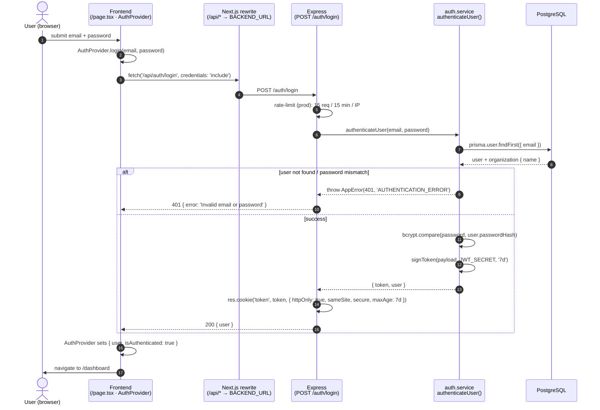
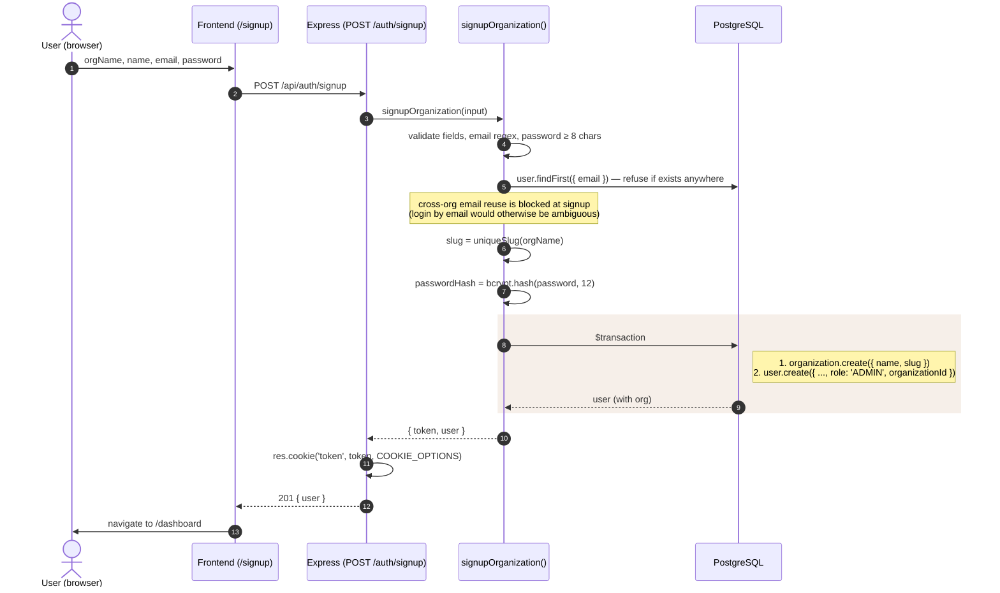
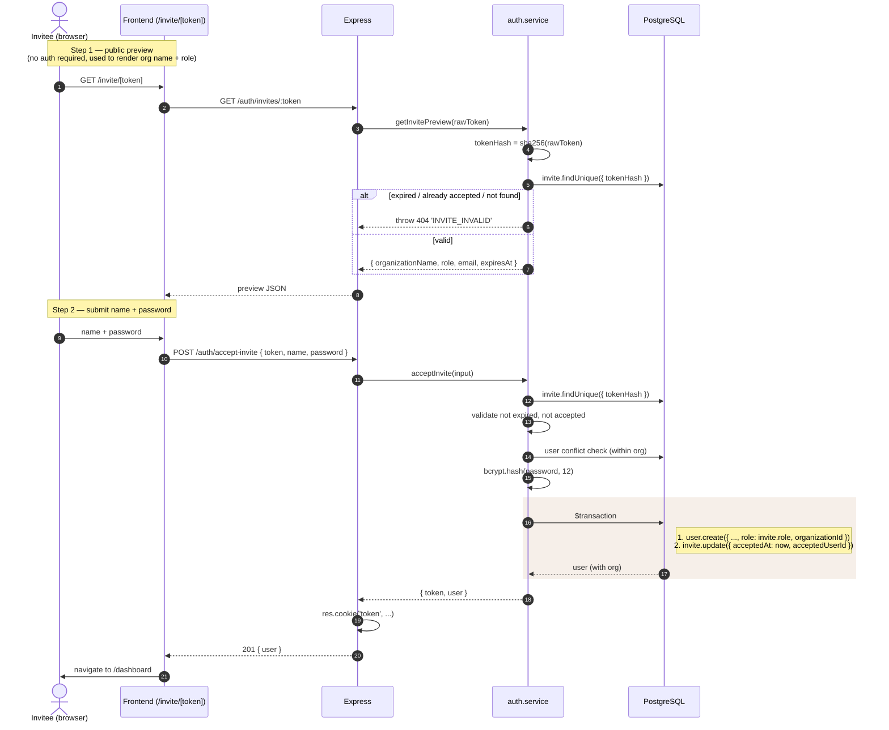
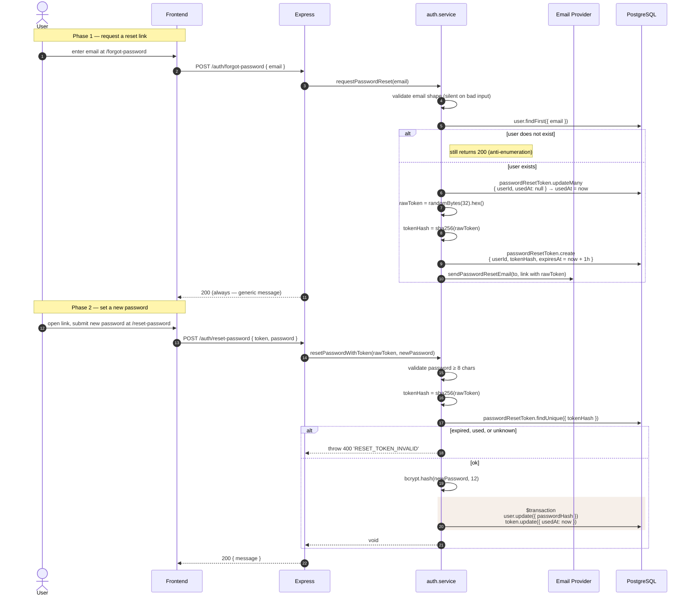

# 07 · Auth Flow

ShelfSight uses **JWTs in HttpOnly cookies** plus role-based middleware
guards. There is no client-side token storage; the browser ships the cookie
with every request thanks to `credentials: 'include'`.

Source files referenced:
- `shelfsight-backend/src/services/auth.service.ts`
- `shelfsight-backend/src/controllers/auth.controller.ts`
- `shelfsight-backend/src/middleware/auth.middleware.ts`
- `shelfsight-frontend/src/lib/api.ts`, `src/components/auth-provider.tsx`

---

## JWT and cookie configuration

| Property         | Value                                                                |
|------------------|----------------------------------------------------------------------|
| Algorithm        | HS256 (default for `jsonwebtoken.sign`)                              |
| Secret           | `JWT_SECRET` env var — required at startup                            |
| Expiry           | **7 days** (`JWT_EXPIRES_IN = '7d'`)                                  |
| Cookie name      | `token`                                                               |
| `httpOnly`       | `true`                                                                |
| `secure`         | `true` in production, `false` in dev                                  |
| `sameSite`       | `'none'` in production, `'lax'` in dev                                |
| `maxAge`         | `7 * 24 * 60 * 60 * 1000` ms (matches JWT expiry)                    |
| `path`           | `'/'`                                                                 |

**Token payload (`AuthPayload`):**

```ts
{
  userId: string;
  email: string;
  role: 'ADMIN' | 'STAFF' | 'PATRON';
  name: string;
  organizationId: string;
  organizationName: string;
}
```

`organizationId` travelling in the token is what powers tenant scoping —
see [10 · Multi-Tenancy](./10-multi-tenancy.md).

**Password hashing:** `bcryptjs` with **salt rounds = 12** for every signup,
invite acceptance, and password reset.

---

## Login



### Logout
```
POST /auth/logout
→ res.clearCookie('token', { httpOnly: true, path: '/' })
→ 200 { message: 'Logged out successfully' }
```
Logout is **stateless on the server** — there is no token blocklist. Any
copy of the cookie that was extracted before logout will remain valid until
its 7-day expiry. (Future: add a token-version column on `User` so server
can revoke.)

### Session restoration
On mount, `AuthProvider` calls `GET /auth/me`. The `requireAuth` middleware
verifies the cookie's JWT and `req.user` is then used by the controller to
return the up-to-date user record.

---

## Signup (creates a new organization)



The first user of every org is always `ADMIN`.

---

## Invite acceptance



Tokens are **stored as SHA-256 hashes** — the raw token only ever exists
client-side and in the email link. Tokens are single-use: `acceptedAt` is
set inside the same transaction that creates the user.

---

## Password reset



**Anti-enumeration:** `requestPasswordReset` always returns 200 with the
same body, regardless of whether the email exists. The endpoint can't be
used to discover registered emails.

---

## Authorisation on protected endpoints

The two-stage middleware in `src/middleware/auth.middleware.ts`:

```ts
router.get('/users',
  authenticateJWT,           // = requireAuth — must have a valid JWT cookie
  requireRole('ADMIN'),      // …and the role check
  wrapAsync(getUsers),
);
```

- `requireAuth` reads `req.cookies.token`, calls `verifyToken()`, and
  attaches the parsed payload to `req.user`.
- `requireRole(...allowed)` checks `req.user.role` against the allowed list
  and throws `AppError(403, 'FORBIDDEN')` otherwise.

The full role × endpoint table lives in [11 · RBAC Matrix](./11-rbac-matrix.md).
