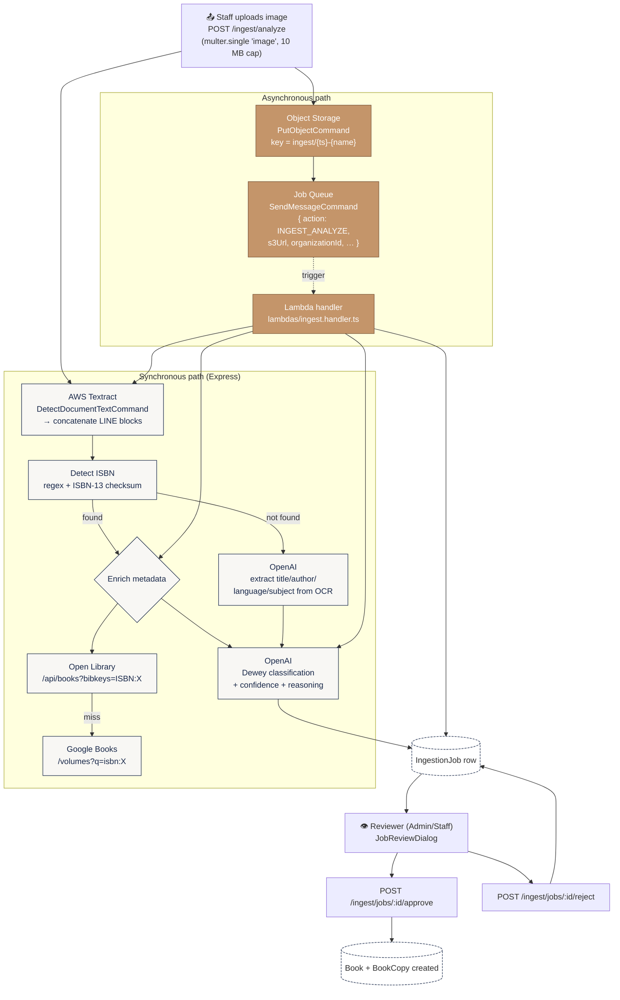
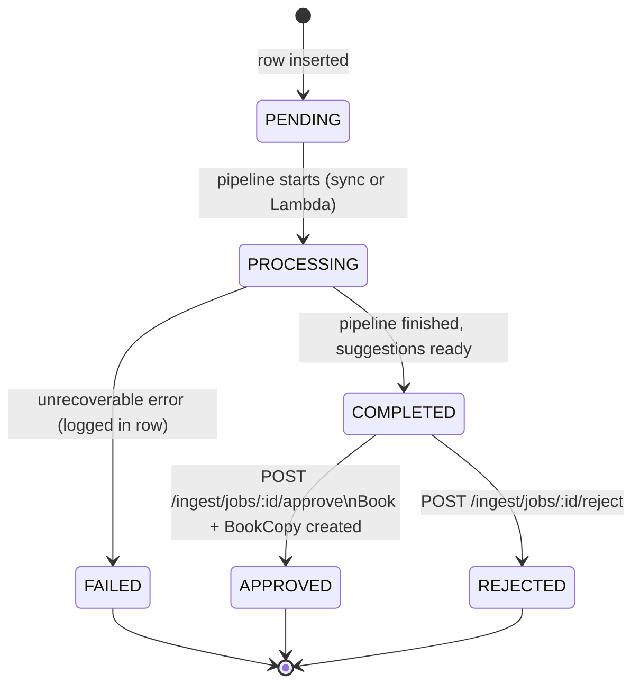
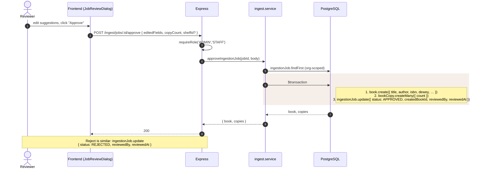

# 08 · AI Ingestion Pipeline

The most complex flow in the system: a staff member uploads a photo of a
book cover/spine, and the system OCRs it, finds an ISBN, enriches metadata
from public APIs, classifies the book on the Dewey Decimal scale, and
presents the result for human review.

The pipeline is **dual-mode**:
1. **Synchronous** — runs inside the Express request and returns suggestions immediately so the UI can show them.
2. **Asynchronous** — the same image is also uploaded to Object Storage and a job is queued so a Lambda can re-run the pipeline (or a longer/more expensive variant) and update the `IngestionJob` record.

Source: `shelfsight-backend/src/services/ingest.service.ts`,
`shelfsight-backend/src/controllers/ingest.controller.ts`,
`shelfsight-backend/src/lambdas/ingest.handler.ts`.

---

## High-level flow



---

## Synchronous sequence

```mermaid
sequenceDiagram
    autonumber
    actor Staff
    participant FE as Frontend (/ingest)
    participant BE as Express<br/>(POST /ingest/analyze)
    participant Svc as ingest.service
    participant T as OCR Service
    participant ISBN as ISBN APIs<br/>(Open Library → Google Books)
    participant LLM as LLM Provider
    participant OS as Object Storage
    participant Q as Job Queue
    participant DB as PostgreSQL

    Staff->>FE: select image, click "Analyze"
    FE->>BE: multipart upload (image)
    BE->>BE: requireAuth + requireRole('ADMIN','STAFF')
    BE->>Svc: analyzeBookImage(buffer, mime, orgId)

    par OCR
        Svc->>T: DetectDocumentText(bytes)
        T-->>Svc: blocks → ocrText
    and Object Storage upload
        Svc->>OS: PutObjectCommand(ingest/{ts}-{name})
        OS-->>Svc: s3Url
        Svc->>Q: SendMessageCommand(action: INGEST_ANALYZE)
        Note right of Q: fire-and-forget;<br/>swallow errors
    end

    Svc->>Svc: detectIsbn(ocrText)<br/>regex + ISBN-13 checksum

    alt ISBN found
        Svc->>ISBN: Open Library lookup
        alt Open Library hit
            ISBN-->>Svc: { title, author, publisher, cover, subjects }
        else miss
            Svc->>ISBN: Google Books fallback
            ISBN-->>Svc: { … }
        end
        Svc->>LLM: classifyDewey(metadata + ocrText)
        LLM-->>Svc: { suggestedDewey, confidence, reasoning }
    else ISBN not found
        Svc->>LLM: extract title/author/language/subject from OCR
        LLM-->>Svc: { suggestedTitle, … }
        Svc->>LLM: classifyDewey(extracted)
        LLM-->>Svc: { suggestedDewey, confidence, reasoning }
    end

    Svc->>DB: ingestionJob.create({ status: COMPLETED, suggestions, ocrText, imageUrl })
    DB-->>Svc: jobId
    Svc-->>BE: { jobId, suggestions }
    BE-->>FE: 200 { jobId, suggestions }

    FE->>Staff: render JobReviewDialog with editable fields
```

### Graceful degradation

The pipeline is built to keep going when an external service is missing or
fails. Each step has a clearly defined fallback:

| Missing / failed              | Behaviour                                                                                  |
|-------------------------------|--------------------------------------------------------------------------------------------|
| `S3_BUCKET_NAME` not set      | Returns a stubbed `https://stub-bucket.s3…/…` URL so the rest of the pipeline still runs.   |
| `SQS_QUEUE_URL` not set       | Skipped silently — async pipeline does not run, sync path returns suggestions anyway.      |
| AWS credentials missing       | Textract returns `''` (empty OCR). ISBN detection short-circuits to the LLM extraction path. |
| `OPENAI_API_KEY` not set      | Dewey classification is skipped. Job is still created with whatever metadata was found.    |
| Open Library miss             | Falls back to Google Books.                                                                |
| Google Books miss             | Returns minimal metadata (just the OCR text and any detected ISBN).                        |

This means the `/ingest` page is **demo-able with zero cloud credentials** —
it just won't have suggestions to render.

---

## Async (Lambda) path

When Object Storage and the Job Queue are configured, the same upload also
triggers an out-of-band run by `lambdas/ingest.handler.ts`. The Lambda
re-runs the pipeline (typically with longer timeouts or a more expensive
model) and updates the same `IngestionJob` row by id.

The Lambda uses the same code paths from `ingest.service` — there's only
one implementation of OCR, ISBN detection, metadata enrichment, and Dewey
classification, just two entry points.

---

## State machine of an `IngestionJob`



---

## Approve / reject



---

## Other ingest endpoints

| Method | Path                      | Purpose                                                                  |
|--------|---------------------------|--------------------------------------------------------------------------|
| `GET`  | `/ingest/lookup`          | Look up a book by ISBN — Open Library → Google Books, no image involved. |
| `POST` | `/ingest/analyze/batch`   | Same pipeline, accepts up to 20 images per request (multer.fields).      |
| `GET`  | `/ingest/jobs`            | Paginated list of past jobs.                                             |
| `GET`  | `/ingest/jobs/:id`        | Get a specific job's full state.                                         |
| `POST` | `/ingest/jobs/:id/approve`| Approve and create the Book/BookCopy rows.                               |
| `POST` | `/ingest/jobs/:id/reject` | Reject without creating any new rows.                                    |

All `/ingest/*` endpoints require `requireAuth + requireRole('ADMIN','STAFF')`.
