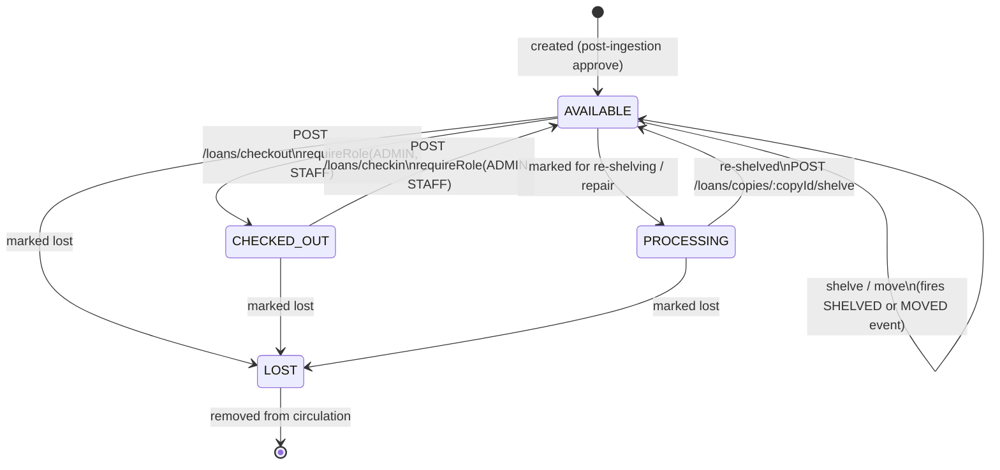
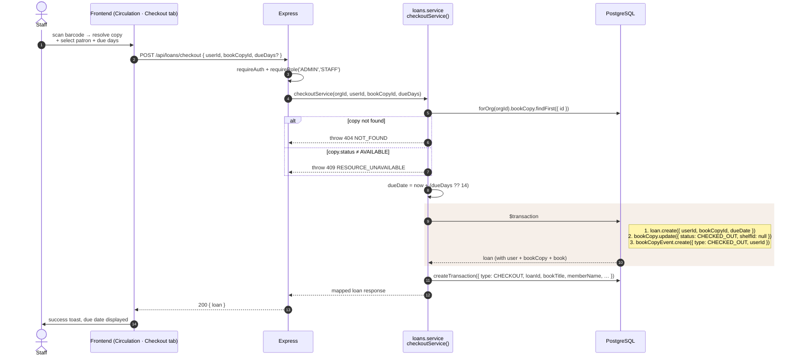
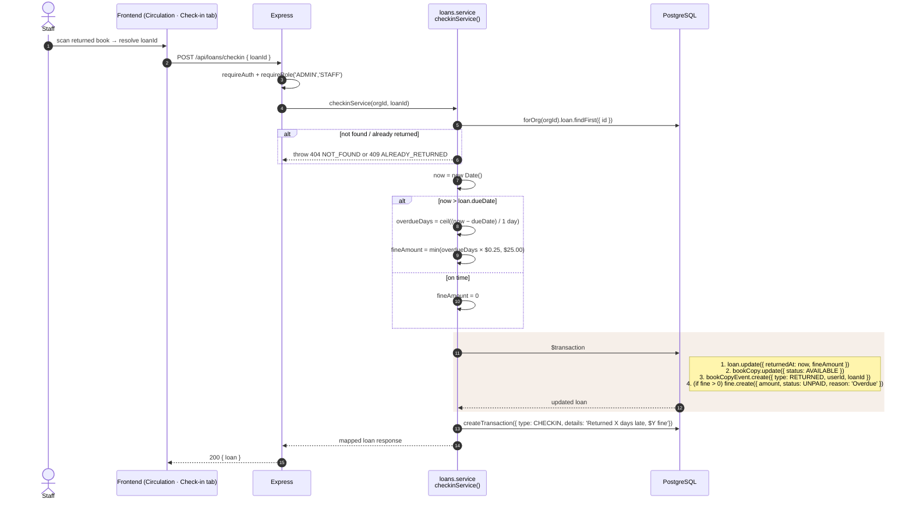

# 09 · Loan Lifecycle

This is the core circulation flow. A `BookCopy` (a physical book) moves
between four states. Each transition is recorded in two audit streams: a
low-level `BookCopyEvent` (per-copy timeline) and a high-level
`TransactionLog` (per-business-event report).

Source: `shelfsight-backend/src/services/loans.service.ts`,
`shelfsight-backend/src/controllers/loans.controller.ts`,
`shelfsight-backend/src/routes/loans.ts`.

---

## `BookCopy.status` state machine



> `LOST` and `PROCESSING` are reachable today through admin/staff actions
> that update `BookCopy.status` directly and emit a `MARKED_LOST` /
> `MARKED_PROCESSING` `BookCopyEvent`.

### `BookCopyEvent.type` ↔ transitions

| From → To                     | Trigger                              | Emits `BookCopyEvent.type`           |
|-------------------------------|--------------------------------------|--------------------------------------|
| `AVAILABLE → CHECKED_OUT`     | `POST /loans/checkout`               | `CHECKED_OUT`                        |
| `CHECKED_OUT → AVAILABLE`     | `POST /loans/checkin`                | `RETURNED`                           |
| any → `AVAILABLE` w/ shelf    | `POST /loans/copies/:id/shelve` (first time)   | `SHELVED`                  |
| any → `AVAILABLE` w/ shelf    | `POST /loans/copies/:id/shelve` (already shelved) | `MOVED`                  |
| any → `LOST`                  | admin/staff action                   | `MARKED_LOST`                        |
| any → `PROCESSING`            | admin/staff action                   | `MARKED_PROCESSING`                  |

---

## Checkout sequence



**Default loan length:** 14 days (`DEFAULT_LOAN_DAYS = 14`).

---

## Check-in sequence (with overdue fine)



### Fine calculation

```ts
// shelfsight-backend/src/services/loans.service.ts
const DEFAULT_LOAN_DAYS = 14;
const FINE_PER_DAY = 0.25;
const MAX_FINE_PER_ITEM = 25.0;

const overdueDays = Math.ceil((now - dueDate) / (1000 * 60 * 60 * 24));
const fineAmount  = Math.min(parseFloat((overdueDays * FINE_PER_DAY).toFixed(2)), MAX_FINE_PER_ITEM);
```

So a book returned 100 days late still incurs only `$25.00`, not `$25.00`
× n.

### Fine resolution

A `Fine` row begins life as `UNPAID`. From there:
- `POST /fines/:fineId/pay` — any authenticated user (typically the patron paying their own fine).
- `POST /fines/:fineId/waive` — `ADMIN` or `STAFF` only.

Both transitions are irreversible (no reset back to `UNPAID`).

---

## Listing loans

`GET /loans` accepts:

| Query param | Values                            | Notes                                                        |
|-------------|-----------------------------------|--------------------------------------------------------------|
| `status`    | `active` / `returned` / `overdue` | `overdue` = `returnedAt is null AND dueDate < now`           |
| `userId`    | uuid                              | Admin/staff filter; patrons are scoped to their own loans by the controller. |
| `search`    | string                            | Substring search across user name/email, copy barcode, book title/author/ISBN. |
| `page`, `limit` | int                           | Default 1, 20.                                               |

The result is mapped to a stable response shape (`mapLoanResponse`) that
includes both `checkedOutAt` / `checkoutDate` aliases and an `isOverdue`
boolean computed at read-time so the UI doesn't have to.

---

## Other copy operations

| Endpoint                                        | Role                      | Effect                                                |
|-------------------------------------------------|---------------------------|-------------------------------------------------------|
| `GET /loans/copies/:copyId/location`            | any auth                  | Current shelf + active loan info.                     |
| `GET /loans/copies/:copyId/history`             | any auth                  | Paginated `BookCopyEvent` audit log.                  |
| `POST /loans/copies/:copyId/shelve`             | ADMIN / STAFF             | Place a copy on a shelf (emits `SHELVED` or `MOVED`). |
